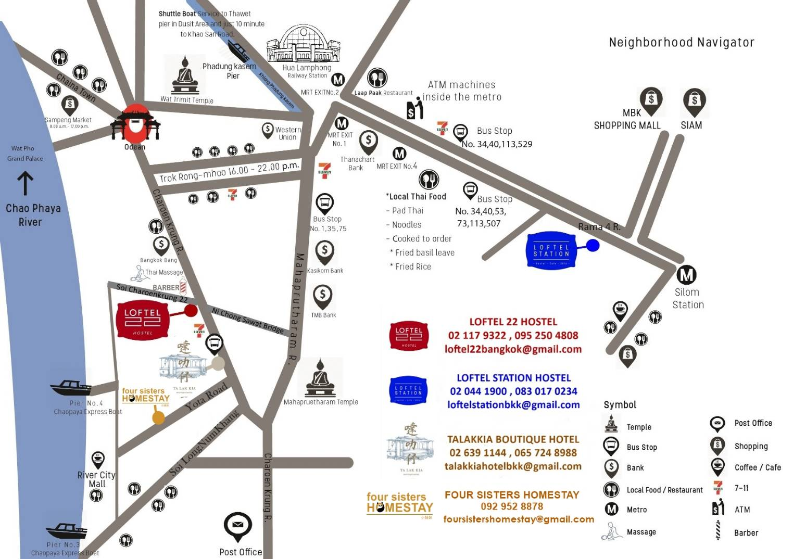
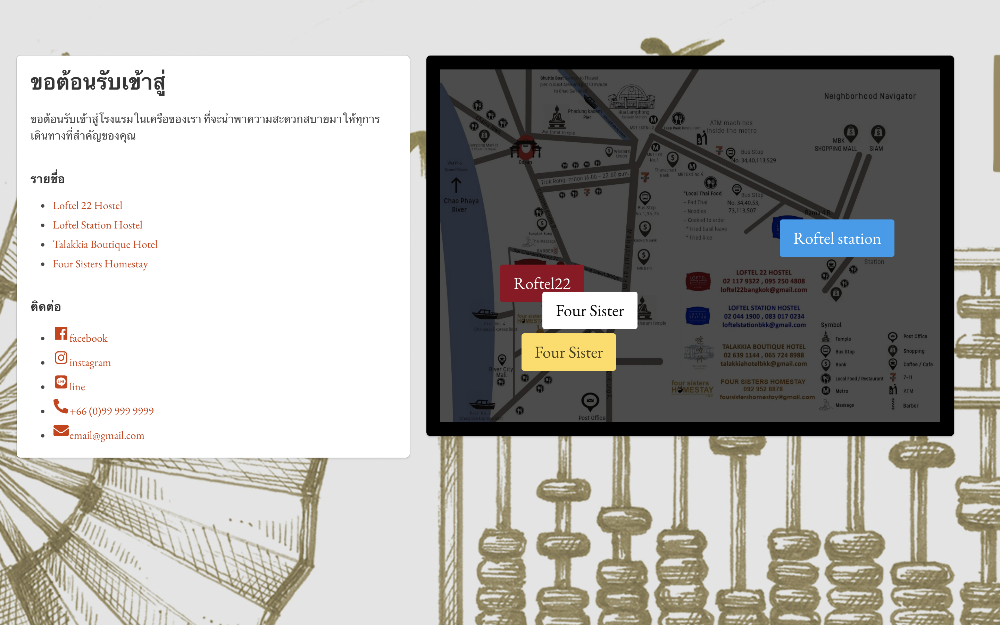
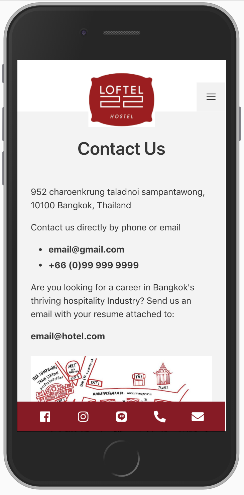

# Loftel Group <em>mockup website</em>

This project is fullstack website of Loftel hostel-hotel group in Thailand.
   

   

### Frontend

Using responsive design that support from mobile to PC.

- [Vue.js](https://vuejs.org)
  - [Bulma](https://bulma.io)
  - [Buefy](https://buefy.github.io)
  - [Pug](https://pugjs.org)

### Backend

Python base content management system (cms) using Django admin.

- [Django](https://www.djangoproject.com/)
  - [admin](https://docs.djangoproject.com/en/2.1/ref/contrib/admin/)

 

## Screen shot

  
  <em>home page for select multi hotel</em>
  
  <em>infomation about hotel</em>
  
  <em>room list</em>  
  
  <em>room reservation</em>    
    
  <em>eg. responsive design</em> 
  

## Inspiration

- http://liveituphostel.com
- http://www.smorehotel.com
- http://www.onceagainhostel.com
- http://hmdasia.ib2hosting.com

<!-- ![][img1] -->

[img1]: screenshot/1.png
[img2]: screenshot/2.png
[img3]: screenshot/3.png
[img4]: screenshot/4.png
